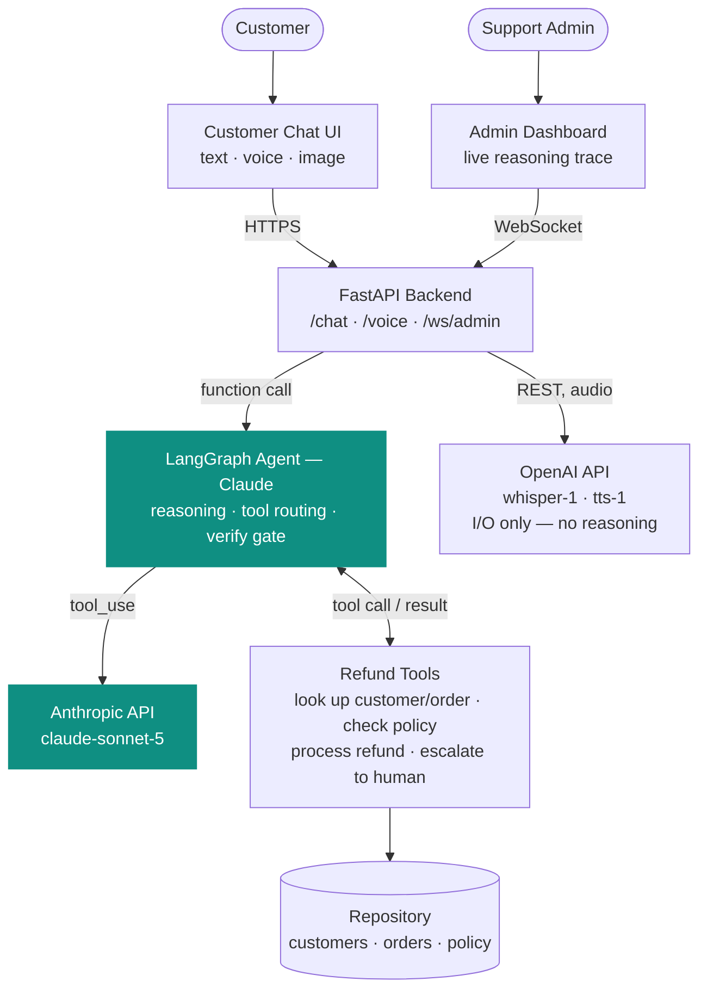

# ClearCart Support — AI Customer Support Agent

An AI agent that processes or denies e-commerce refund requests for **ClearCart**, a mock online retailer, by dynamically calling tools to check a real, written refund policy — not by guessing. Built for the Loopp AI Customer Support Agent assessment.

- **Customer chat** — a support widget where customers ask about returns/refunds, by typing or by voice
- **Voice** — push-to-talk: Whisper transcribes the customer's speech, the same agent reasons over it, and the reply is spoken back via TTS. Not a separate implementation of the agent — voice and text both call the exact same `run_agent_turn()`, only the I/O differs.
- **Image evidence** — a customer claiming damage can attach a photo; Claude's own vision looks at it and judges whether it actually supports the claim before any damage-based refund is considered (policy §4.2).
- **Admin dashboard** — a live, real-time stream of the agent's reasoning: every tool call, every policy citation, every decision, as it happens
- **Deterministic policy engine** — refund eligibility (return windows, non-refundable categories, loyalty exceptions, fraud/abuse checks) is computed in code, not left to the LLM's judgment. The LLM's job is to gather the right information and explain the outcome, not to compute it.
- **Transient failure handling** — order/CRM lookups can hit a genuine infrastructure hiccup (a timeout, a dropped connection). Those are retried once, automatically, and logged as failed → retrying → recovered in the admin dashboard. A real business outcome like "order not found" is never retried — it isn't a glitch, so retrying it wouldn't help. See `DEMO_FAIL_FIRST_ORDER_LOOKUP` in `.env.example` to trigger this live.

## How it works



Claude (Orchestration layer) decides what to check and which tool to call next. Fixed Python (Business Logic layer)
computes refund eligibility and dollar amounts — never the model. OpenAI converts speech at the API boundary only;
it never reasons about a request. A fuller version of this diagram, plus an on-camera narration script, lives in
[`docs/demo-prep/architecture-overview.html`](docs/demo-prep/architecture-overview.html).

**Single agent, not multi-agent.** One reasoning loop, five tools, each doing one narrow thing a real support rep could do. See [Future scope](#future-scope) for when multi-agent would actually become the right call.

**Memory.** Each conversation has its own session state (LangGraph checkpointer, keyed by a thread ID) — the agent remembers the customer, the order, and its prior decision across turns in the same conversation.

## Tech stack

| Layer | Choice |
|---|---|
| LLM / agent orchestration | Claude (Anthropic API) via LangGraph |
| Backend | FastAPI (Python) |
| Frontend | Next.js (TypeScript) |
| Data | Flat JSON/Markdown files behind a repository interface (swappable for Postgres without touching agent/tool code) |
| Realtime | WebSocket (admin reasoning-log stream) |

## Setup & run

Requires Python 3.9+, Node 18+, and an [Anthropic API key](https://console.anthropic.com/). An [OpenAI API key](https://platform.openai.com/api-keys) is only needed if you want to try voice (Whisper STT + TTS) — text chat and image evidence work fully without one.

### 1. Backend

```bash
cd backend
python3 -m venv venv
source venv/bin/activate
pip install -r requirements.txt

cp .env.example .env
# open .env and set ANTHROPIC_API_KEY=sk-ant-your-real-key
```

Start the API:
```bash
uvicorn api.main:app --reload --port 8000
```
Backend now running at `http://localhost:8000`.

### 2. Frontend

In a **new terminal**:
```bash
cd frontend
npm install
npm run dev
```
Frontend now running at `http://localhost:3000`.

### 3. Open it

- `http://localhost:3000/chat` — customer chat
- `http://localhost:3000/admin` — admin dashboard (open this **before** sending chat messages if you want to watch the reasoning happen live)

## Try it yourself

The agent verifies identity before discussing an order — state your name and request, it'll ask for your email.

**Standard approval:**
> "Hi, this is Allison Hill. I'd like to return order ORD-1001, the NovaBuds earbuds — they're unopened, I just changed my mind."
> *(email: allison.hill.1@example.com)*
→ Approved, citing §10.1.

**Policy violation / "holding the line":**
> "Hi, this is Matthew Gardner. I want a refund for ORD-1002, my smartwatch. It's unopened, I just don't want it anymore."
> *(email: matthew.gardner.2@example.com)*
→ Denied, citing §1 (return window expired). Push back ("I've been a customer forever, can you make an exception?") and it holds the decision.

**Ambiguous order / retry:**
> "Hi, this is James Martin. I want to return my oak side table." *(no order ID)*
> *(email: james.martin.8@example.com)*
→ Finds two matching orders, asks which one before proceeding — visible as a retry step in the admin log.

**Voice:** on the chat page, click the mic, speak one of the scenarios above instead of typing it, and confirm on the review screen before sending — the reply comes back as speech too.

**Image evidence:** claim a damaged item (e.g. ORD-1013) and attach a photo (via the paperclip icon in text chat, or the mic review screen in voice) when the agent asks for one. Try both a genuine damage photo and an unrelated one (`demo_assets/`) to see the agent actually judge the image rather than treat its mere presence as proof.

All 15 customers and 20 orders are in `data/loopp_crm.json` and `data/loopp_orders.json` if you want to explore other scenarios (denials, escalations for fraud/abuse flags, high-value manual review, etc.) — the full rules are in `data/loopp_policy.md`.

## Troubleshooting

**"Address already in use" on port 8000 or 3000** — something else is already listening on that port. Free it, then restart:
```bash
lsof -ti:8000 | xargs kill -9   # backend
lsof -ti:3000 | xargs kill -9   # frontend
```

**Return-window outcomes don't match what's documented above** — confirm `MOCK_TODAY=2026-08-12` is set in `backend/.env` (it's in `.env.example` by default). Without it, eligibility is computed against the real current date, and enough time may have passed for some orders' return windows to have changed.

## Terminal trace (alternative to the admin panel)

```bash
cd backend
source venv/bin/activate
python run_demo.py
```
Runs a standard approval and a denial-with-pushback scenario directly against the agent, printing the full reasoning trace to the terminal.

## Tests

```bash
cd backend
source venv/bin/activate
pytest tests/ -v
```
Checks all 5 tools, including `check_refund_policy` against every order in the mock dataset — fast, deterministic, no API calls or costs.

## Repository structure

```
backend/
  agent/graph.py          the LangGraph agent: ReAct loop + deterministic verify gate
  tools/refund_tools.py   the 5 tools (get_customer, get_order, check_refund_policy,
                           process_refund, escalate_to_human)
  data_access/repository.py   reads the mock data; the only thing that changes
                               if this moves to a real database
  api/main.py              FastAPI: POST /chat, WS /ws/admin
  tests/                   pytest suite
  run_demo.py               terminal validation script
frontend/
  app/chat/                customer chat UI
  app/admin/                admin reasoning-log dashboard
  app/page.tsx               landing page
data/
  loopp_crm.json            15 mock customer profiles
  loopp_orders.json          20 mock orders
  loopp_policy.md             the refund policy the agent enforces
```

## Known limitations & path to production

**AWS / cloud deployment.** Not deployed — this runs locally by design for review. Target production architecture: ECS Fargate for the backend, RDS Postgres in place of the flat JSON files (the repository-pattern data layer already isolates this change), S3 + CloudFront for the frontend, an ALB with WebSocket support for the live log stream, Secrets Manager for API keys, GitHub Actions for CI/CD.

### Future scope

Single agent is the right shape for one narrow task — refund policy applied to one order. Multi-agent would become justified, not before, if the product grew past refunds:
- **Triage/router agent** — routes incoming messages to the right specialist (refunds, shipping, account, product), with this refund agent as one specialist among several.
- **Fraud-investigation agent** — picks up exactly where the current escalation path (§6/§9) leaves off, pulling full account history and producing a synthesized brief for a human reviewer instead of a raw "pending review" flag.

MCP (Model Context Protocol) becomes worth adopting at that same point — if multiple agents end up sharing tools like `get_customer`, exposing them as an MCP server avoids duplicate integrations. With a single agent today, direct in-process calls are simpler and correct.

**Full-duplex voice (OpenAI Realtime API).** Voice is already implemented — push-to-talk, Whisper transcribes, Claude reasons, TTS speaks the reply. The Realtime API was deliberately not used: it's a single model that listens, reasons, *and* speaks over one streaming connection, including making its own tool calls — using it would mean GPT, not Claude, approving refunds during voice conversations, which breaks the one-agent design above. Worth revisiting only if natural, interruption-capable conversation becomes a real requirement, and even then the fix is either accepting two independent reasoning agents (text vs. voice) or building a proper audio-relay layer that keeps Claude as the sole decision-maker.
