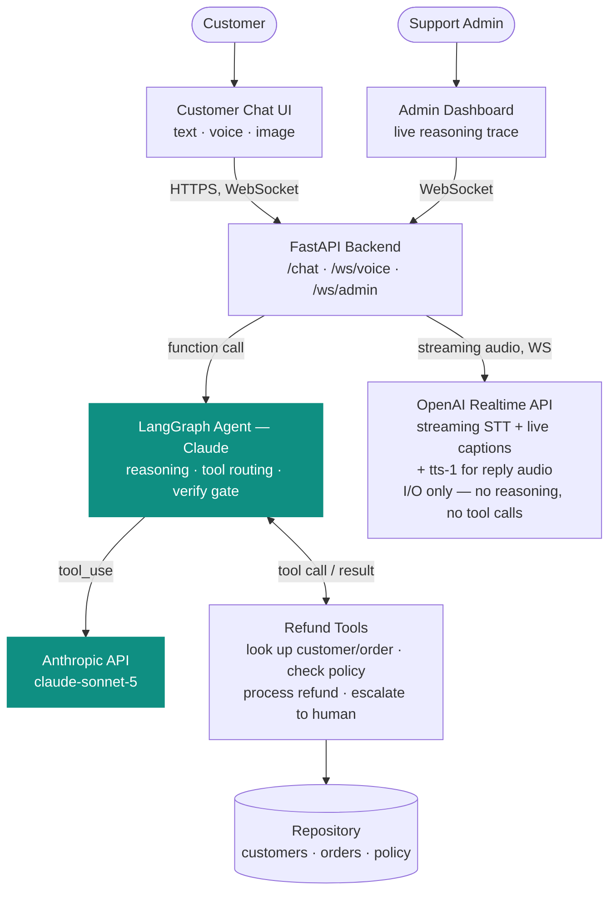

# ClearCart Support — AI Customer Support Agent

An AI agent that processes or denies e-commerce refund requests for **ClearCart**, a mock online retailer, by dynamically calling tools to check a real, written refund policy — not by guessing. Built for the Loopp AI Customer Support Agent assessment.

- **Customer chat** — a support widget where customers ask about returns/refunds, by typing or by voice
- **Voice** — push-to-talk over a live WebSocket: the OpenAI Realtime API streams the customer's mic audio to a VAD-segmented transcription, with live captions as they speak, then the same agent reasons over the final transcript, and the reply is spoken back via TTS. Not a separate implementation of the agent — voice and text both call the exact same `run_agent_turn()`, only the I/O differs. Realtime is deliberately used only as a streaming audio layer, not as the reasoner — see [Voice pipeline](#voice-pipeline-openai-realtime-api) below for why.
- **Image evidence** — a customer claiming damage can attach a photo; Claude's own vision looks at it and judges whether it actually supports the claim before any damage-based refund is considered (policy §4.2).
- **Admin dashboard** — a live, real-time stream of the agent's reasoning: every tool call, every policy citation, every decision, as it happens
- **Deterministic policy engine** — refund eligibility (return windows, non-refundable categories, loyalty exceptions, fraud/abuse checks) is computed in code, not left to the LLM's judgment. The LLM's job is to gather the right information and explain the outcome, not to compute it.
- **Transient failure handling** — order/CRM lookups can hit a genuine infrastructure hiccup (a timeout, a dropped connection). Those are retried once, automatically, and logged as failed → retrying → recovered in the admin dashboard. A real business outcome like "order not found" is never retried — it isn't a glitch, so retrying it wouldn't help. See `DEMO_FAIL_FIRST_ORDER_LOOKUP` in `.env.example` to trigger this live.

## How it works

ClearCart Support is an AI agent for processing and denying e-commerce refund requests. The application contains
mock CRM data for 15 customers, order data, and a strict written refund policy.

The core agent is implemented using LangGraph with Claude as the reasoning model. Claude handles natural-language
understanding and dynamically decides which tools it needs to call; LangGraph provides the agent loop, state
management, conditional routing, tool execution, verification, and short-term conversational memory.

The important design decision is that Claude does not independently calculate refund eligibility or monetary
amounts. Those decisions are handled by deterministic Python tools against trusted order data and the written
refund policy.



Both external providers connect at the layer that actually calls them — OpenAI at the API layer (it converts speech
only, never reasons or calls tools), Anthropic at the Orchestration layer (the only place reasoning happens). A
fuller version of this diagram, plus an on-camera narration script, lives in
[`docs/demo-prep/architecture-overview.html`](docs/demo-prep/architecture-overview.html).

**Single agent, not multi-agent.** One reasoning loop, five tools, each doing one narrow thing a real support rep could do. See [Future scope](#future-scope) for when multi-agent would actually become the right call.

**Memory.** Each conversation has its own session state (LangGraph checkpointer, keyed by a thread ID) — the agent remembers the customer, the order, and its prior decision across turns in the same conversation.

### Voice pipeline (OpenAI Realtime API)

Voice is push-to-talk over a WebSocket (`/ws/voice/{thread_id}`), not a one-shot record-and-upload. While the
customer talks, raw mic audio streams to the backend in ~170ms PCM16 chunks, which relays it to an OpenAI Realtime
session (the current GA API, `client.realtime.connect(...)`, not the older `client.beta.realtime` shape) and gets
back live, VAD-segmented captions as they speak — visible on both the recording indicator and the review screen.
Transcription is `gpt-4o-mini-transcribe` with the language pinned to English (`"language": "en"` in the session
config) — without that pin, short utterances can occasionally get misidentified and transcribed in the wrong
script entirely.

The Realtime API is also a full speech-to-speech model that can listen, reason, *and* reply — including making its
own tool calls — over that same connection. That part is deliberately turned off (`turn_detection.create_response:
false` in `backend/api/main.py`'s `ws_voice()`): letting it stay on would mean GPT, not Claude, approving refunds
during voice conversations, a second and divergent decision-maker for the same job. So Realtime here is scoped to
exactly one job — streaming speech-to-text — and the customer's final transcript is handed to the same
`run_agent_turn()` (Claude) that text chat uses. The reply is spoken back through a plain, deterministic `tts-1`
call rather than the Realtime API's own generative voice output, since a generative restate of a refund decision
could paraphrase away a policy citation like "§10.1" — this is a compliance-sensitive reply, not small talk.

**Review, not a manual send.** Recording stops on a click, on 5 seconds of silence, or at a hard time cap (below).
It then lands on a review screen showing the live transcript and an audio playback, and auto-sends itself ~2
seconds later — no click needed for the common case. A "Cancel" / "Send now" pair is still there for manual
override, and attaching a photo (damage evidence) cancels the auto-send outright and requires the manual "Send
now" click, so a slower native file-picker interaction can never race the timer and silently ship without the
attachment.

**Guardrails.** The Realtime connection is billed by connection time and takes client-controlled bytes (audio
chunks, an inline base64 photo) before any of it reaches the agent, so `ws_voice()` enforces: a 120-second hard cap
per push-to-talk turn (a 90-second client-side timer normally stops the mic first), a per-chunk audio size limit,
and a size cap on the inline image so it stays under Claude's 10MB image limit after decoding.

**Observability.** Voice activity (`speech_started`, `speech_stopped`, each transcribed chunk, and any
transcribe/connect/synthesize failure) is broadcast to the same admin WebSocket the agent's reasoning trace uses —
open `/admin` while testing voice to see it live, same as any other turn.

## Tech stack

| Layer | Choice |
|---|---|
| LLM / agent orchestration | Claude (Anthropic API) via LangGraph |
| Voice | OpenAI Realtime API (streaming STT) + `tts-1` (reply audio) — Claude remains the sole reasoner |
| Backend | FastAPI (Python) |
| Frontend | Next.js (TypeScript) |
| Data | Flat JSON/Markdown files behind a repository interface (swappable for Postgres without touching agent/tool code) |
| Realtime | WebSocket (voice streaming, admin reasoning-log stream) |

## Setup & run

Requires Python 3.9+, Node 18+, and an [Anthropic API key](https://console.anthropic.com/). An [OpenAI API key](https://platform.openai.com/api-keys) with **Realtime API access** is only needed if you want to try voice — text chat and image evidence work fully without one.

### 1. Backend

```bash
cd backend
python3 -m venv venv
source venv/bin/activate
pip install -r requirements.txt

cp .env.example .env
# open .env and set ANTHROPIC_API_KEY=sk-ant-your-real-key
```

Start the API:
```bash
uvicorn api.main:app --reload --port 8000
```
Backend now running at `http://localhost:8000`.

### 2. Frontend

In a **new terminal**:
```bash
cd frontend
npm install
npm run dev
```
Frontend now running at `http://localhost:3000`.

### 3. Open it

- `http://localhost:3000/chat` — customer chat
- `http://localhost:3000/admin` — admin dashboard (open this **before** sending chat messages if you want to watch the reasoning happen live)

## Try it yourself

The agent verifies identity before discussing an order — state your name and request, it'll ask for your email.

**Standard approval:**
> "Hi, this is Allison Hill. I'd like to return order ORD-1001, the NovaBuds earbuds — they're unopened, I just changed my mind."
> *(email: allison.hill.1@example.com)*
→ Approved, citing §10.1.

**Policy violation / "holding the line":**
> "Hi, this is Matthew Gardner. I want a refund for ORD-1002, my smartwatch. It's unopened, I just don't want it anymore."
> *(email: matthew.gardner.2@example.com)*
→ Denied, citing §1 (return window expired). Push back ("I've been a customer forever, can you make an exception?") and it holds the decision.

**Ambiguous order / retry:**
> "Hi, this is James Martin. I want to return my oak side table." *(no order ID)*
> *(email: james.martin.8@example.com)*
→ Finds two matching orders, asks which one before proceeding — visible as a retry step in the admin log.

**Voice:** on the chat page, click the mic, speak one of the scenarios above instead of typing it — live captions appear as you talk — then stop and it sends itself a couple seconds later (or click "Send now"/"Cancel" to override). The reply comes back as speech too.

**Image evidence:** claim a damaged item (e.g. ORD-1013) and attach a photo (via the paperclip icon in text chat, or the mic review screen in voice) when the agent asks for one. Try both a genuine damage photo and an unrelated one (`demo_assets/`) to see the agent actually judge the image rather than treat its mere presence as proof.

All 15 customers and 20 orders are in `data/loopp_crm.json` and `data/loopp_orders.json` if you want to explore other scenarios (denials, escalations for fraud/abuse flags, high-value manual review, etc.) — the full rules are in `data/loopp_policy.md`.

## Troubleshooting

**"Address already in use" on port 8000 or 3000** — something else is already listening on that port. Free it, then restart:
```bash
lsof -ti:8000 | xargs kill -9   # backend
lsof -ti:3000 | xargs kill -9   # frontend
```

**Return-window outcomes don't match what's documented above** — confirm `MOCK_TODAY=2026-08-12` is set in `backend/.env` (it's in `.env.example` by default). Without it, eligibility is computed against the real current date, and enough time may have passed for some orders' return windows to have changed.

**Voice fails immediately with "Couldn't reach the voice service"** — two independent things gate the Realtime connection, and it's worth checking both:
- On macOS with the python.org installer (not Homebrew), Python's `ssl` module doesn't wire into the system CA trust store by default, so the raw WebSocket connection Realtime uses fails `CERTIFICATE_VERIFY_FAILED` even though ordinary `httpx`-based API calls (chat, TTS) work fine. Fix: run `/Applications/Python <version>/Install Certificates.command`, or point `SSL_CERT_FILE` at the `certifi` bundle already installed in the venv (see the commented example in `.env.example`).
- The OpenAI key/project needs Realtime API access enabled — a plain chat/TTS-only key doesn't automatically get it.

Real errors are broadcast to the admin dashboard (`node: "voice"`) with the actual exception text, not just the generic customer-facing message, so check `/admin` first.

## Terminal trace (alternative to the admin panel)

```bash
cd backend
source venv/bin/activate
python run_demo.py
```
Runs a standard approval and a denial-with-pushback scenario directly against the agent, printing the full reasoning trace to the terminal.

## Tests

```bash
cd backend
source venv/bin/activate
pytest tests/ -v
```
Checks all 5 tools, including `check_refund_policy` against every order in the mock dataset — fast, deterministic, no API calls or costs.

## Repository structure

```
backend/
  agent/graph.py          the LangGraph agent: ReAct loop + deterministic verify gate
  tools/refund_tools.py   the 5 tools (get_customer, get_order, check_refund_policy,
                           process_refund, escalate_to_human)
  data_access/repository.py   reads the mock data; the only thing that changes
                               if this moves to a real database
  api/main.py              FastAPI: POST /chat, WS /ws/voice/{thread_id}, WS /ws/admin
  tests/                   pytest suite
  run_demo.py               terminal validation script
frontend/
  app/chat/                customer chat UI
  app/admin/                admin reasoning-log dashboard
  app/page.tsx               landing page
data/
  loopp_crm.json            15 mock customer profiles
  loopp_orders.json          20 mock orders
  loopp_policy.md             the refund policy the agent enforces
```

## Known limitations & path to production

**AWS / cloud deployment.** Not deployed — this runs locally by design for review. Target production architecture: ECS Fargate for the backend, RDS Postgres in place of the flat JSON files (the repository-pattern data layer already isolates this change), S3 + CloudFront for the frontend, an ALB with WebSocket support for the live log stream, Secrets Manager for API keys, GitHub Actions for CI/CD.

### Future scope

Single agent is the right shape for one narrow task — refund policy applied to one order. Multi-agent would become justified, not before, if the product grew past refunds:
- **Triage/router agent** — routes incoming messages to the right specialist (refunds, shipping, account, product), with this refund agent as one specialist among several.
- **Fraud-investigation agent** — picks up exactly where the current escalation path (§6/§9) leaves off, pulling full account history and producing a synthesized brief for a human reviewer instead of a raw "pending review" flag.

MCP (Model Context Protocol) becomes worth adopting at that same point — if multiple agents end up sharing tools like `get_customer`, exposing them as an MCP server avoids duplicate integrations. With a single agent today, direct in-process calls are simpler and correct.

**Full speech-to-speech voice.** The OpenAI Realtime API is already integrated (see [Voice pipeline](#voice-pipeline-openai-realtime-api) above), but scoped deliberately to streaming STT/live captions — its own reasoning and tool-calling stay off so Claude remains the sole decision-maker. Letting the Realtime model itself hold the conversation (true interruption-capable, speak-while-listening speech-to-speech) is worth revisiting only if that becomes a real requirement, and even then the fix is either accepting two independent reasoning agents (text vs. voice) or extending today's relay so Realtime calls out to the same tools mid-conversation instead of reasoning on its own.
